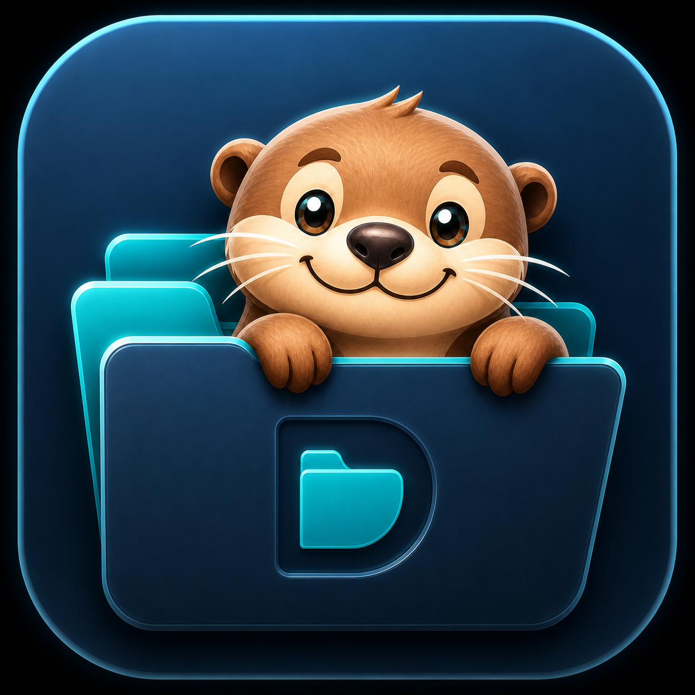

# DirOtter

<p align="center">
  
</p>

<p align="center">
  <a href="README.md">English</a> |
  <a href="README.zh-CN.md">中文</a> |
  <a href="README.fr.md">Français</a> |
  <a href="README.es.md">Español</a> |
  <a href="README.de.md">Deutsch</a>
</p>

**DirOtter** est un analyseur de disque et assistant de nettoyage open source, local-first, construit avec Rust.

Il aide les utilisateurs à comprendre où l'espace disque est utilisé, à identifier les gros dossiers et fichiers, à examiner les candidats de fichiers en double et à nettoyer en sécurité les caches ou fichiers temporaires à faible risque sans téléverser les données du système de fichiers vers un service cloud.

DirOtter est conçu pour être transparent, respectueux de la vie privée et pratique pour les utilisateurs qui veulent une alternative plus sûre aux utilitaires de nettoyage opaques.

## État du projet

DirOtter est actuellement à un stade précoce mais prêt pour la production.

L'application Windows principale est fonctionnelle, testée et empaquetée en build portable. Le projet a passé la porte qualité actuelle pour le formatage, la compilation, les tests, le linting et la validation du build workspace.

État actuel de validation :

- `cargo fmt --all -- --check` passe
- `cargo check --workspace` passe avec 0 erreur et 0 avertissement
- `cargo test --workspace` passe avec 94 tests
- `cargo clippy --workspace --all-targets -- -D warnings` passe
- `cargo build --workspace` réussit

Le dépôt inclut déjà des workflows CI, l'empaquetage de release Windows, des scripts d'installation portable et des hooks optionnels de signature de code.

## Pourquoi DirOtter existe

Les systèmes d'exploitation et applications modernes génèrent de nombreux caches, fichiers temporaires, installateurs téléchargés, ressources dupliquées et usages de stockage cachés. Les outils de nettoyage existants sont souvent trop opaques, trop agressifs ou trop dépendants d'hypothèses propres à une plateforme.

DirOtter vise une approche plus sûre et plus transparente :

1. Analyser les disques locaux avec des stratégies prévisibles.
2. Expliquer ce qui utilise l'espace.
3. Recommander des candidats de nettoyage avec des niveaux de risque.
4. Laisser l'utilisateur vérifier avant suppression.
5. Préférer les opérations réversibles, comme le déplacement vers la corbeille.
6. Garder les données du système de fichiers en local par défaut.

L'objectif à long terme est de fournir un outil open source fiable d'analyse et de nettoyage disque pour Windows, macOS et Linux.

## Fonctionnalités principales

### Analyse disque

DirOtter analyse les dossiers sélectionnés et construit une vue structurée de l'utilisation du disque.

Le pipeline d'analyse prend en charge :

- l'analyse concurrente
- la publication par lots
- les mises à jour UI limitées
- l'annulation
- la gestion de l'état terminé
- les instantanés de session légers

Le mode d'analyse par défaut se concentre sur une stratégie recommandée, tandis que le comportement avancé peut être ajusté pour les dossiers complexes ou les grands disques externes.

### Recommandations de nettoyage

DirOtter utilise une analyse basée sur des règles pour identifier les candidats potentiels de nettoyage.

Les catégories de recommandations incluent :

- les fichiers temporaires
- les dossiers de cache
- les chemins de cache de navigateurs ou d'applications
- les installateurs téléchargés
- les fichiers générés courants à faible risque
- les gros fichiers et dossiers qui méritent une vérification

Les recommandations sont notées et regroupées par niveau de risque afin de faire remonter d'abord les éléments les plus sûrs.

### Vérification des fichiers en double

DirOtter peut identifier des candidats de fichiers en double avec une stratégie par taille d'abord, puis un hachage en arrière-plan.

Le flux de vérification des doublons est conçu pour éviter les suppressions automatiques agressives. Il présente des groupes de candidats, recommande un fichier à conserver et évite de sélectionner automatiquement les emplacements à haut risque.

### Exécution du nettoyage

Les actions de nettoyage prises en charge incluent :

- déplacement vers la corbeille
- suppression définitive
- nettoyage rapide pour les candidats de cache à faible risque

L'exécution du nettoyage signale la progression et les compteurs de résultat pendant le traitement des fichiers en arrière-plan.

### Stockage local-first

DirOtter ne nécessite pas de base de données pour l'usage normal.

Les paramètres sont stockés dans un fichier léger `settings.json`. Les résultats de session ne sont stockés que sous forme d'instantanés compressés temporaires et sont supprimés lorsqu'ils ne sont plus nécessaires.

Si le dossier des paramètres n'est pas accessible en écriture, DirOtter bascule vers un stockage temporaire de session et l'indique clairement dans l'interface des paramètres.

### Internationalisation

DirOtter permet de choisir parmi 19 langues :

- arabe
- chinois
- néerlandais
- anglais
- français
- allemand
- hébreu
- hindi
- indonésien
- italien
- japonais
- coréen
- polonais
- russe
- espagnol
- thaï
- turc
- ukrainien
- vietnamien

La porte qualité actuelle de traduction UI couvre toutes les langues prises en charge pour les textes UI livrés. Toute nouvelle chaîne UI visible par l'utilisateur doit être traduite pour chaque langue sélectionnable avant fusion.

## Modèle de sécurité

DirOtter reste volontairement conservateur autour de la suppression.

Le projet considère le nettoyage comme une opération sensible, car une erreur peut entraîner une perte de données. DirOtter est donc conçu autour de plusieurs principes de sécurité :

- afficher les candidats de nettoyage avant exécution
- classifier les recommandations par niveau de risque
- préférer la suppression réversible via la corbeille
- éviter de sélectionner automatiquement les candidats de doublons à haut risque
- rendre la suppression définitive explicite
- limiter le nettoyage rapide aux caches ou chemins temporaires à faible risque
- présenter clairement les résultats et les échecs d'opération

Les travaux futurs incluent un audit plus approfondi du comportement de corbeille propre aux plateformes, des chemins à haut risque, des liens symboliques, des échecs de permission et des cas limites de suppression irréversible.

## Structure du workspace

```text
crates/
  dirotter-app        # Point d'entrée de l'application native
  dirotter-ui         # UI, pages, view models, état d'interaction
  dirotter-core       # Node store, agrégation, requêtes
  dirotter-scan       # Flux d'événements de scan et publication d'agrégation
  dirotter-dup        # Détection de candidats de fichiers en double
  dirotter-cache      # settings.json et instantanés de session
  dirotter-platform   # Intégration Explorer, corbeille, volumes, staging de nettoyage
  dirotter-actions    # Planification de suppression et exécution du nettoyage
  dirotter-report     # Export de rapports texte, JSON et CSV
  dirotter-telemetry  # Diagnostics et métriques d'exécution
  dirotter-testkit    # Outils de régression et de performance
```

## Construire et lancer

### Prérequis

- Rust stable toolchain
- Cargo
- Une plateforme desktop prise en charge

Windows est actuellement la cible la plus mature. Le support macOS et Linux fait partie de la feuille de route multiplateforme.

### Lancer l'application

```bash
cargo run -p dirotter-app
```

### Build de release

```bash
cargo build --release -p dirotter-app
```

### Porte qualité

Avant de fusionner des changements, les vérifications suivantes doivent passer :

```bash
cargo fmt --all -- --check
cargo check --workspace
cargo test --workspace
cargo clippy --workspace --all-targets -- -D warnings
cargo build --workspace
```

## Release et empaquetage

Le dépôt inclut un workflow de release Windows et des scripts d'empaquetage.

Les composants de release actuels incluent :

- workflow CI pour formatage, vérification, tests et linting
- workflow de release Windows
- script d'empaquetage Windows portable
- script optionnel de signature de code Windows
- script d'installation portable
- script de désinstallation portable

Les artefacts Windows actuels incluent un build ZIP portable et un fichier de somme SHA-256.

La signature de code est prise en charge par le pipeline de release, mais nécessite des secrets configurés avant de produire des builds signés.

## Feuille de route

DirOtter se concentre actuellement sur l'amélioration de la fiabilité, de la sécurité et du support multiplateforme.

Les éléments prioritaires et intermédiaires incluent :

1. Configurer les secrets de signature de code Windows pour produire des artefacts signés.
2. Ajouter des tests de régression visuelle automatisés pour l'UI.
3. Étendre la couverture Linux pour le système de fichiers et le comportement trash/delete.
4. Étendre la couverture macOS pour le système de fichiers et le comportement trash/delete.
5. Auditer les limites de sécurité du nettoyage et de la suppression.
6. Améliorer l'automatisation de release et la génération de changelog.
7. Améliorer la documentation contributeur.
8. Ajouter plus de tests d'intégration pour grands dossiers, liens symboliques, erreurs de permission et disques externes.
9. Maintenir la couverture des 19 langues UI lors de l'ajout de nouvelles chaînes visibles.
10. Évaluer une persistance optionnelle de l'historique tout en gardant l'expérience par défaut légère et local-first.

## Comment Codex peut aider ce projet

DirOtter est un bon candidat pour la maintenance open source assistée par IA, car le projet possède un vrai codebase Rust multi-crate, des comportements de système de fichiers sensibles à la sécurité, des objectifs multiplateformes et une charge de maintenance continue.

Les tâches de maintenance open source adaptées à Codex incluent :

- relire les changements Rust dans le workspace
- trier les issues et reproduire les bugs
- améliorer la couverture de tests pour le scan, le nettoyage, la détection de doublons et les rapports
- auditer les règles de sécurité de nettoyage
- vérifier les cas limites propres aux plateformes
- améliorer les workflows CI et release
- générer et relire les mises à jour de documentation
- aider à maintenir la cohérence des traductions
- rédiger des résumés de pull request et des notes de release

Le support de Codex aiderait à garder le projet pleinement open source tout en réduisant la charge de maintenance nécessaire pour rendre DirOtter plus sûr, plus fiable et plus utile sur plusieurs plateformes.

## Contribution

Les contributions sont bienvenues.

Les domaines utiles incluent :

- performance de scan du système de fichiers
- règles de sécurité de nettoyage
- UX de vérification des fichiers en double
- comportement de la corbeille Windows
- support Linux et macOS
- tests UI
- tests de régression visuelle
- améliorations d'accessibilité
- documentation
- traductions
- automatisation de packaging et release

Avant de soumettre une pull request, exécutez la porte qualité complète :

```bash
cargo fmt --all -- --check
cargo check --workspace
cargo test --workspace
cargo clippy --workspace --all-targets -- -D warnings
```

Une documentation contributeur plus détaillée devrait être ajoutée dans `CONTRIBUTING.md`.

## Sécurité

DirOtter travaille avec des données locales de système de fichiers et des opérations de nettoyage, donc la sécurité et la prévention des pertes de données sont des préoccupations importantes.

Veuillez signaler les problèmes potentiels de sécurité ou de perte de données de façon privée si possible. Une politique dédiée `SECURITY.md` devrait définir le canal de signalement, les versions prises en charge et le processus de divulgation.

Les zones de préoccupation particulières incluent :

- comportement de suppression non sûr
- classification incorrecte des chemins à haut risque
- problèmes de traversée de liens symboliques ou junctions
- problèmes de frontières de permission
- échecs de corbeille/trash propres aux plateformes
- bugs de suppression irréversible
- recommandations de nettoyage incorrectes

## Confidentialité

DirOtter est local-first.

L'application est conçue pour analyser les métadonnées locales du système de fichiers sans téléverser par défaut les résultats de scan, chemins de fichiers ou recommandations de nettoyage vers un service cloud.

Toute future télémétrie ou collecte de crash reports devrait être opt-in, clairement documentée et respectueuse de la vie privée.

## Licence

Le workspace déclare actuellement la licence MIT dans `Cargo.toml`. Un fichier `LICENSE` à la racine devrait être ajouté avant une distribution plus large.

## Objectif du projet

DirOtter vise à devenir un outil open source, transparent et local-first d'analyse et de nettoyage disque auquel les utilisateurs peuvent faire confiance.

Le projet privilégie :

- la sécurité plutôt que le nettoyage agressif
- l'explicabilité plutôt que l'automatisation opaque
- le traitement local plutôt que la dépendance au cloud
- la maintenabilité plutôt que l'empilement rapide de fonctionnalités
- la fiabilité multiplateforme plutôt que les raccourcis propres à une plateforme
